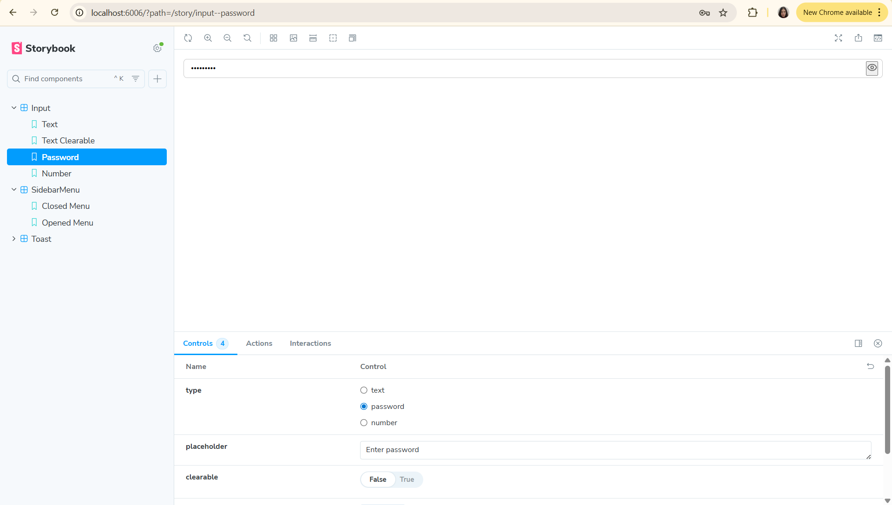
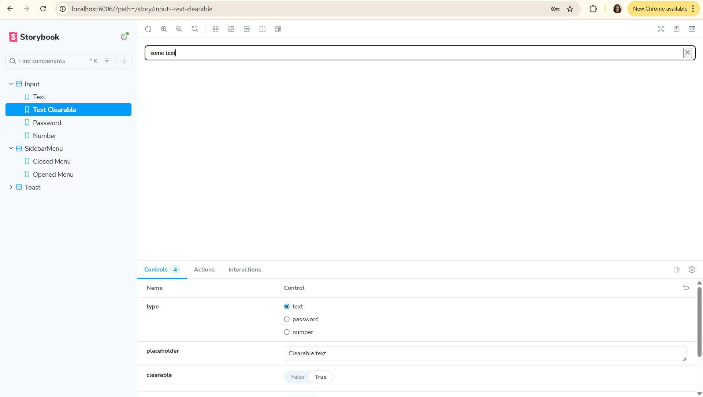
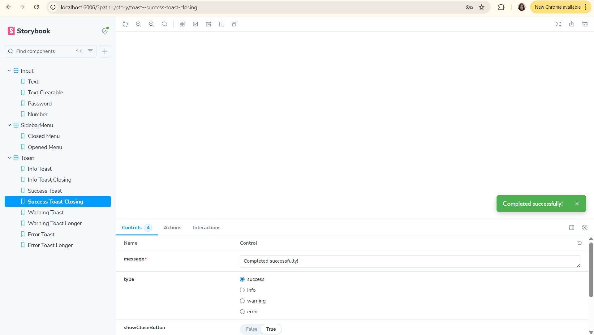
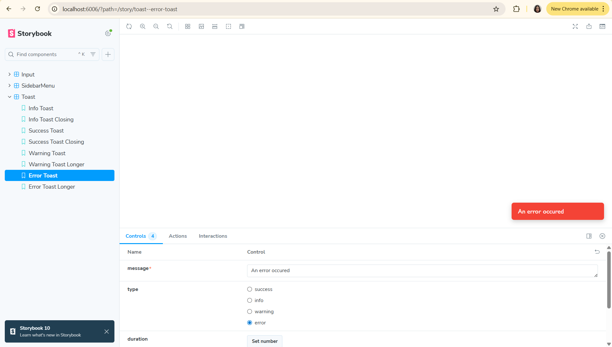
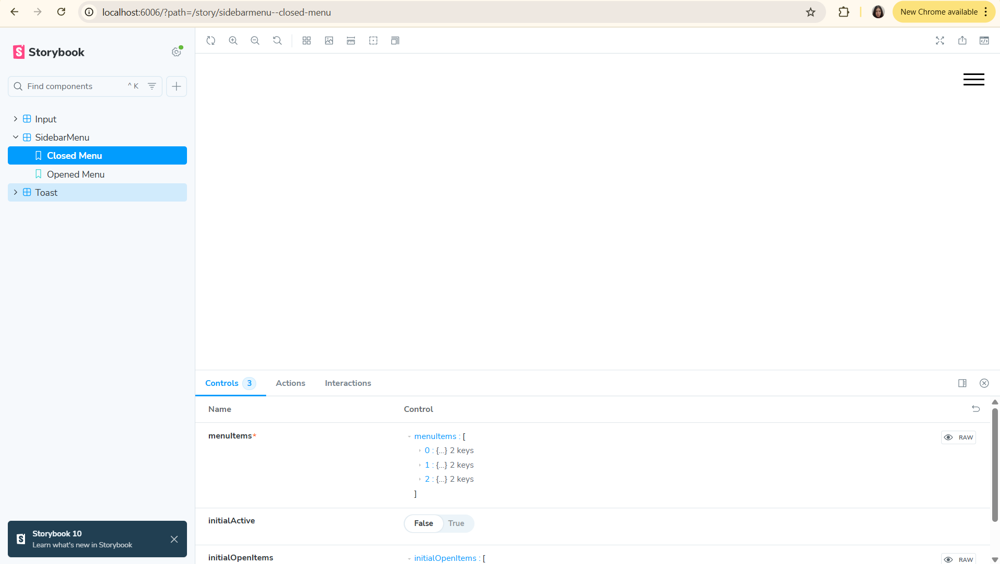
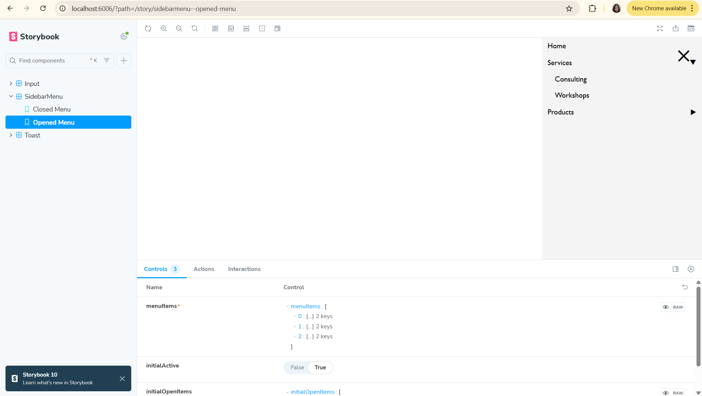
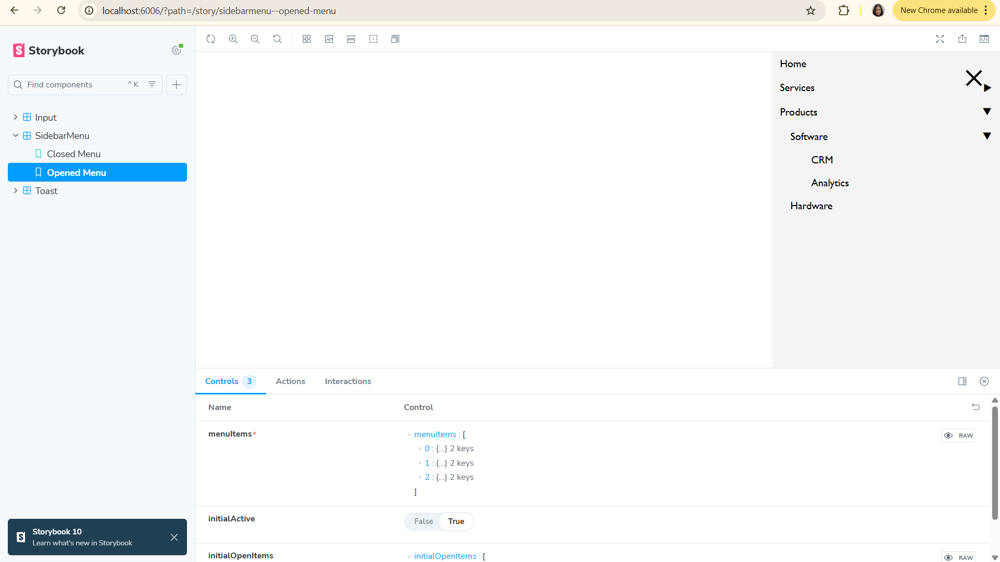

This is a [Next.js](https://nextjs.org) project bootstrapped with [`create-next-app`](https://nextjs.org/docs/app/api-reference/cli/create-next-app).

## Getting Started

First, run the development server:

```bash
npm run dev
# or
yarn dev
# or
pnpm dev
# or
bun dev
```

Open [http://localhost:3000](http://localhost:3000) with your browser to see the result.

You can start editing the page by modifying `app/page.tsx`. The page auto-updates as you edit the file.

This project uses [`next/font`](https://nextjs.org/docs/app/building-your-application/optimizing/fonts) to automatically optimize and load [Geist](https://vercel.com/font), a new font family for Vercel.

Screenshot of Input with type "password"


Screenshot of Input with clearable text


Screenshot of Toast with type "success" and the manual closing button


Screenshot of self-closing Toast with type "error"


Screenshot of closed menu


Screenshot of opened menu


Screenshot of opened menu with 1-level submenu open


Screenshot of opened menu with 2-level submenu open

